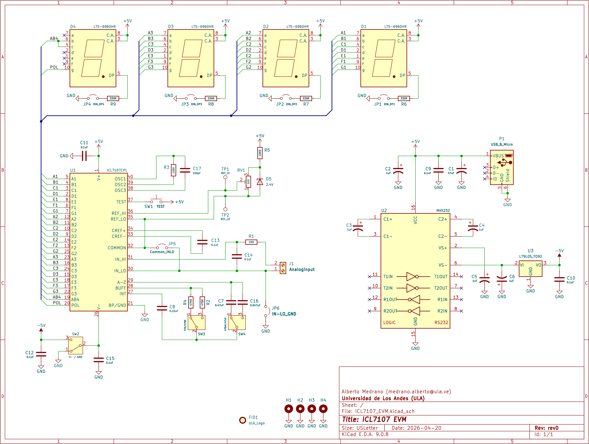

# ICL7107 Evaluation Module (EVM)


Este repositorio contiene el diseño de hardware de una tarjeta de evaluación para el ICL7107, un convertidor analógico-digital (ADC) de 3.5 dígitos diseñado para controlar displays LED. Este proyecto se desarrolla como material de práctica para la asignatura Laboratorio de Electrónica II de la Universidad de Los Andes (ULA).

## Descripción del Proyecto

El ICL7107 es un circuito integrado ampliamente utilizado en la instrumentación electrónica, específicamente en la construcción de voltímetros y multímetros digitales. Esta placa permite a los estudiantes y entusiastas experimentar con el acondicionamiento de señales y la visualización de datos sin necesidad de realizar el cableado complejo en protoboard.

## Características Técnicas

- Conversor: ICL7107 (ADC Dual-Slope).
- Visualización: 3.5 dígitos para displays de siete segmentos (ánodo común).
- Alimentación: $$+5VDC$$ vía microUSB, internamente contiene circuito inversor para el $$-5VDC$$.
- Ajustes: Potenciómetro de precisión para calibración de voltaje de referencia.
- Software de Diseño: [KiCad EDA](https://www.kicad.org/)  9.0 (o superior).

## Esquema del Circuito

A continuación, se presenta el diagrama esquemático del sistema:



## Lista de Materiales (BOM)

Para ensamblar este módulo, se requieren los siguientes componentes:

| Cantidad | Referencia | Descripción |
| :----------- | :-------------- | :------------- |
| 1	| C1 | Capacitor Electrolítico 47uF/16V |
| 5	| C2-6 | Capacitor Electrolítico 1uF/25V |
| 1	| C7 | Capacitor Cerámico 0.47uF |
| 1	| C8 | Capacitor Cerámico 0.22uF |
| 7	| C9-15 | Capacitor Cerámico 0.1uF |
| 1	| C16 | Capacitor Cerámico 0.047uF |
| 1	| C17 | Capacitor Cerámico 100pF |
| 4	| D1-4 | Display 7 segmentos, ánodo común |
| 1	| D5 | Diodo Zener 2.4V |
| 1	| J1 | Bornera 2 pines |
| 1	| JP1-6 | 1x02 Pin header con jumpers |
| 1	| P1 | Conector microUSB |
| 1	| R1 | Resistencia 1/4W 1 M ohm |
| 1	| R2 | Resistencia 1/4W 470k ohm |
| 1	| R3 | Resistencia 1/4W 100k ohm |
| 1	| R4 | Resistencia 1/4W 47k ohm |
| 1	| R5 | Resistencia 1/4W 10k ohm |
| 4	| R6-9 | Resistencia 1/4W 330 ohm |
| 1	| RV1 | Potenciómetro Trimmer 1k ohm |
| 1	| SW1 | Pulsador 6mm |
| 3	| SW2-4 | Switch, CuK OS102011MA1QN1 o similar |
| 1	| TP1-2 | Punta de prueba, Keystone 5010 o similar |
| 1	| U1 | Base de 40 pines + ICL7107 |
| 1	| U2 | Base de 16 pines + MAX232 |
| 1	| U3 | Regulador LM7905 |

Nota 1: La lista completa detallada se encuentra en el archivo ICL7107_EVM_BOM.csv

Nota 2: Se recomienda colocar 8x sockets de 1x05 pines hembra para la instalación de los display 7-segmento, de modo que pueda removerlos fácilmente de ser necesario.

## Instalación y Uso

Clona el repositorio:

```git clone https://github.com/ecadmaster/ICL7107_EVM.git```

Abre el archivo .kicad_pro con KiCad para revisar el PCB o generar los archivos Gerber para fabricación.

Consulta la datasheet para entender los límites operativos del integrado.

## Contribuciones y Licencia
Este proyecto está bajo la licencia MIT. Las sugerencias de mejora para el entorno académico de la Escuela de Ingeniería Eléctrica son bienvenidas.
